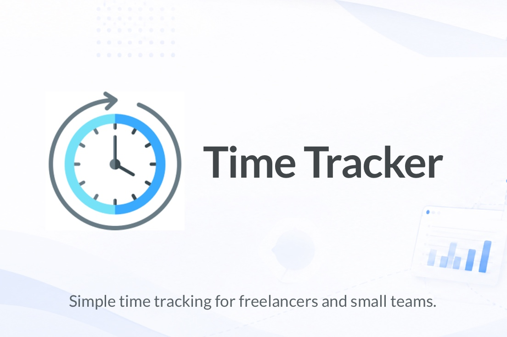

# Time Tracker App Guide

**Time Tracker by Jim Kulakowski**

> [!WARNING]
> This repository is public. Review [SECURITY-HARDENING.md](SECURITY-HARDENING.md) before deploying to production.

## Overview
This is a server-rendered PHP time-tracking app for freelancers/small teams.

Core features:
- User authentication (register/login/logout)
- Password reset by email (PHPMailer + SMTP)
- Client/Project/Category management
- Start/stop timers and edit entries
- Dashboard summaries and charts
- CSV export
- Account management (profile, avatar, password, delete account)
- Per-user timezone support

## Tech Stack
- PHP (plain PHP pages, no framework)
- MySQL (via PDO)
- Bootstrap 5 (UI/layout)
- Chart.js (local vendor file): `/assets/vendor/chartjs/chart.umd.min.js`

## App Structure
- `middleware.php`: bootstraps config, helpers, session, DB.
- `config.php`: runtime config loaded from external secrets.
- `db.php`: PDO connection.
- `helpers.php`: shared auth, timezone, formatting, mail, account delete, and utility functions.
- `auth/*.php`: login/register/forgot/reset/logout.
- `dashboard.php`: weekly totals, donut + trend charts, quick timer actions.
- `track.php`: running timers and start/stop.
- `entries.php`, `entries_ajax.php`, `entry_edit.php`: listing/filtering/loading/editing/exporting entries.
- `clients.php`, `projects.php`, `categories.php` (+ edit pages): management CRUD.
- `account.php`: profile, timezone, password, avatar, delete account modal.
- `migrations/*.sql`: schema changes (for example timezone column).

## Request Flow
1. Page includes `middleware.php`.
2. `middleware.php` loads:
   - `config.php`
   - `helpers.php`
   - session via `start_session(...)`
   - DB via `db.php`
3. Protected pages call `require_login()`.
4. Page logic runs queries and renders HTML.

## Data Model (inferred from code)
- `users` (includes `timezone`, `avatar_path`, password hash)
- `clients`
- `projects` (belongs to client + user)
- `work_categories`
- `time_records`
- `password_reset_tokens`
- legacy/optional tables referenced by code: `jobs`, `report_links`

## Timezone Behavior
- App default timezone is in config: `config.php -> app.timezone`.
- Each user has `users.timezone` (IANA value, e.g. `Europe/London`).
- Session stores timezone through `set_user_session(...)`.
- Conversions use helpers:
  - `user_timezone()`
  - `user_timezone_object()`
  - `formatLocalTime(...)`
  - `formatLocalTimeRecentEntries(...)`

Migration used for this:
- `migrations/2026-06-01_add_users_timezone.sql`

## Secrets Implementation
Yes, this app uses external secrets files and does not store sensitive credentials in repo code.

`config.php` loads:
- `../secrets/db_credentials.php`
- `../secrets/email_secret.php`
- `../secrets/app_secret.php`

Expected shape:

`../secrets/db_credentials.php`
```php
<?php
return [
  'dsn' => 'mysql:host=...;dbname=...;charset=utf8mb4',
  'user' => '...',
  'pass' => '...',
];
```

`../secrets/email_secret.php`
```php
<?php
return [
  'CRM_SMTP_HOST' => '...',
  'CRM_SMTP_USER' => '...',
  'CRM_SMTP_PASS' => '...',
  'CRM_SMTP_PORT' => 465,
  'CRM_FROM_EMAIL' => '...',
  'CRM_FROM_NAME' => 'Time Tracker',
];
```

`../secrets/app_secret.php`
```php
<?php
return [
  'APP_BASE_URL' => 'https://time.example.com',
  'APP_TIMEZONE' => 'America/New_York',
  'APP_SESSION_SECURE' => true,
];
```

Important:
- Keep `secrets/` outside web root and out of version control.
- Ensure filesystem permissions restrict read access.
- Rotate SMTP/DB credentials if exposed.

## First-Time Setup Checklist
1. Create DB and tables.
2. Apply migrations in `migrations/`:
   `php scripts/migrate.php`
3. Create `../secrets/db_credentials.php`.
4. Create `../secrets/email_secret.php`.
5. Create `../secrets/app_secret.php`.
6. Confirm local PHPMailer path exists at `lib/PHPMailer`.

### Optional Browser-Based Installer
- On a fresh install, the app automatically redirects to `/setup.php`.
- Enter DB, SMTP, and app URL/timezone credentials to generate secret files.
- Run migrations, then create the first admin account.
- After the first user exists, setup auto-locks and normal app routes resume.
- Optional: set `config.php` -> `setup.enabled` to `true` only when you intentionally need setup access again.

## Notes for Future Development
- Keep timezone conversion centralized in helpers.
- Avoid hardcoding timezone strings in page files.
- Prefer prepared statements (already used consistently).
- When adding new user-scoped tables, include cleanup in `delete_user_account(...)`.

## License
Time Tracker by Jim Kulakowski is licensed under the **Elastic License 2.0 (ELv2)**.

In plain language:
- You may use this app for your own personal use or internal freelance business use (including self-hosting on your own server).
- You may modify it for your own needs.
- You may not offer this app to third parties as a hosted or managed service (for example, as a SaaS time-tracking product).

See the full license terms in [`LICENSE`](LICENSE).
